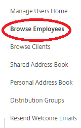
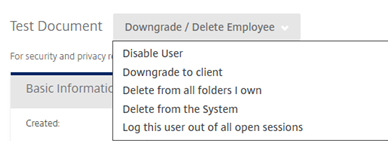

# Browsing and Managing Employees

Employees can be managed from the ‘Browse Employees’ tab under ‘Manage Users Home’.

From this page you can search for employees through either user name or by manually looking for them through the list of employees. To manage an employee, locate their name and click the settings cog on the far right.

From there, you will be presented with a user configuration page with permission to change ‘Basic Information’, ‘Admin Privileges’ and ‘Basic User Permissions’. There is also a drop down menu next to the name of the user called ‘Downgrade / Delete Employee’. When highlighted over it will reveal the following:

‘Disable User’ will disable the user and therefore make account inactive until you reactivate it.

‘Downgrade to client’ will downgrade the employee account to a client account. This will give them less permission’s automatically.

‘Delete from all folders I own’ will remove the user from viewing or editing any folders that are owned by you.

‘Delete from the System’ will completely remove the user from the system and everything connected with them. You will get an option, when this feature is selected, to have all files and folders personal to them moved to your account.

'Log this user out of all open sessions’ will log them out of every session that is open. This can be useful a user has forgotten to logout of a session at another location and would like to log off remotely.

